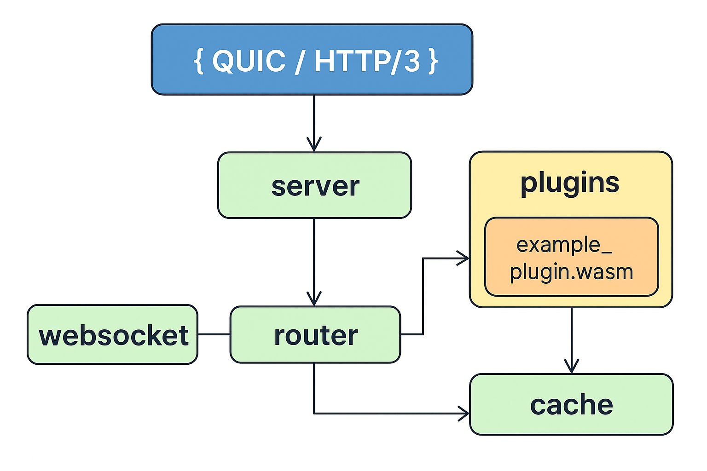

# Web-Server-Rust

# create plugin
cargo new hello_plugin --lib
cd hello_plugin

# compila
rustup target add wasm32-unknown-unknown

cargo build --release --target wasm32-unknown-unknown

cp target/wasm32-unknown-unknown/release/hello_plugin.wasm ../rust_web/plugins/

# wasmsign2
cargo install wasmsign2-cli

# gen chiave
wasmsign2 keygen --public-key public.key --secret-key secret.key

# firmare il plugin:
wasmsign2 sign --input-file plugin.wasm --output-file plugin-signed.wasm --secret-key secret.key

